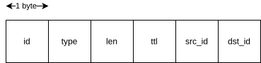
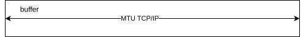

# ESP32 Ring Network - Technical Documentation

## 1. Component Structure
- **config**: Role and network configuration
- **ring_link**: Main communication layer
- **ring_link_internal**: Ring internal management 
- **ring_link_lowlevel**: Low-level operations
- **ring_link_netif**: Network interface
- **spi**: Custom SPI driver
- **wifi**: WiFi connection management
- **lwip_custom_hooks**: Custom lwIP hooks
- **physim**: Physical layer simulation
- **utils**: General utilities
- **route**: Static routes

## 2. Internal Communication

## 2.1 Low-Level Protocol
At the very bottom, this project rely on SPI for communication. aunque se puede configurar ya que el codigo permite extenderlo a otro tipos de comunicacion de bajo nivel siempre y cuando se definan las primitivas:
PRIMITIVAS

Message format structure:

**Header**: 6 bytes



**Buffer**




```c
typedef struct {
    ring_link_payload_id_t id;        // 8-bit message identifier
    ring_link_payload_buffer_type_t buffer_type;
    uint8_t len;
    uint8_t ttl;                      // Time To Live to prevent infinite message loops
    config_id_t src_id;               // Source node identifier (North, South, etc.)
    config_id_t dst_id;               // Destination node identifier
    char buffer[RING_LINK_PAYLOAD_BUFFER_SIZE];
} ring_link_payload_t;
```


#### Field Descriptions
- **id** (8 bits): Message identifier. Simple counter implementation sufficient for ring network scale.
- **buffer_type**: Defines the message type in the ring:
  - `INTERNAL (0x11)`: Ring internal messages
  - `INTERNAL_HEARTBEAT (0x12)`: Monitoring heartbeat
  - `ESP_NETIF (0x80)`: Network communication
- **ttl**: Time To Live counter to prevent messages from circulating indefinitely in the ring
- **src_id**: Identifies the source node (North, South, East, West, AP)
- **dst_id**: Identifies the destination node
- **buffer**: Payload content, which can contain either:
  - Internal ring management data
  - IP payload information
  - The interpretation depends on buffer_type


Payload Types:
- `INTERNAL (0x11)`: Ring internal messages
- `INTERNAL_HEARTBEAT (0x12)`: Monitoring heartbeat
- `ESP_NETIF (0x80)`: Network communication


#### Thread-safety

The SPI driver and most of low-level drivers are not thread-safe so we added different serialization mechanisms to ensure a correct operation.

<-- lowlevel IO diagram-->

- Reception: Considering that reception is a constant polling operation regardless of the type of message, we use a single task that is continuously calling lowlevelreceive and sends the message to a queue. Note that this is the only task where the function lowlevelreceive is called.
In a different task, this queue is consumed and sent to specific queues based on the buffer type field to be consumed by the correct handler.

<-- receive pipeline diagram -->

- Transmission: As opposed to the reception, the lowleveltransmit operation is called on-demand from different parts of the code, so we added a mutex lock around the shared resource to ensure thread-safety.


### 2.2 Internal Protocol
- handler diagram


On top of this, we have 2 applications running:
- heartbeat
- broadcast

### 2.3 Network Interface

intro for esp-netif
primitives


### 3. Node Configuration

GPIO-based configuration system:
```c
static config_t s_config = {
    .id          = CONFIG_ID_NONE,
    .mode        = CONFIG_MODE_NONE,
    .orientation = CONFIG_ORIENTATION_NONE,
    .rx_ip_addr  = 0,
    .tx_ip_addr  = 0,
};
```